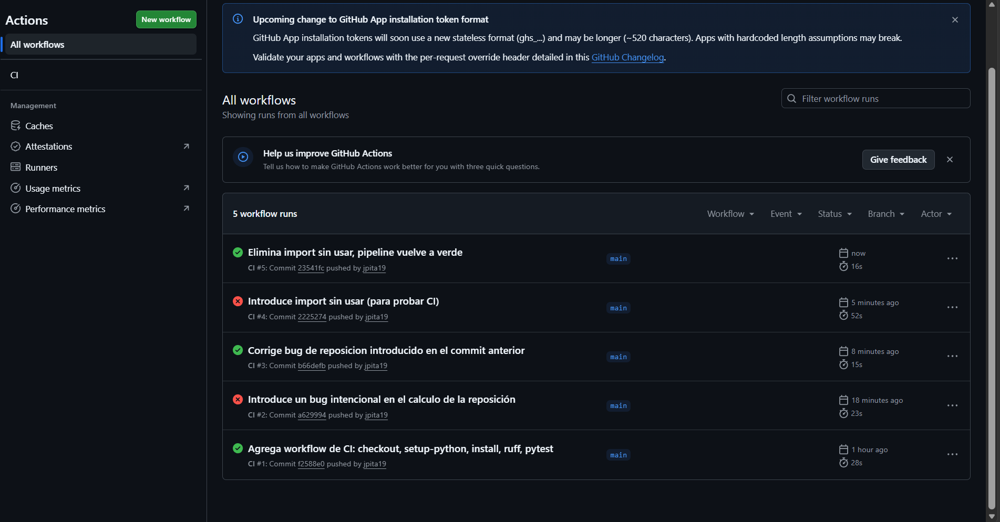
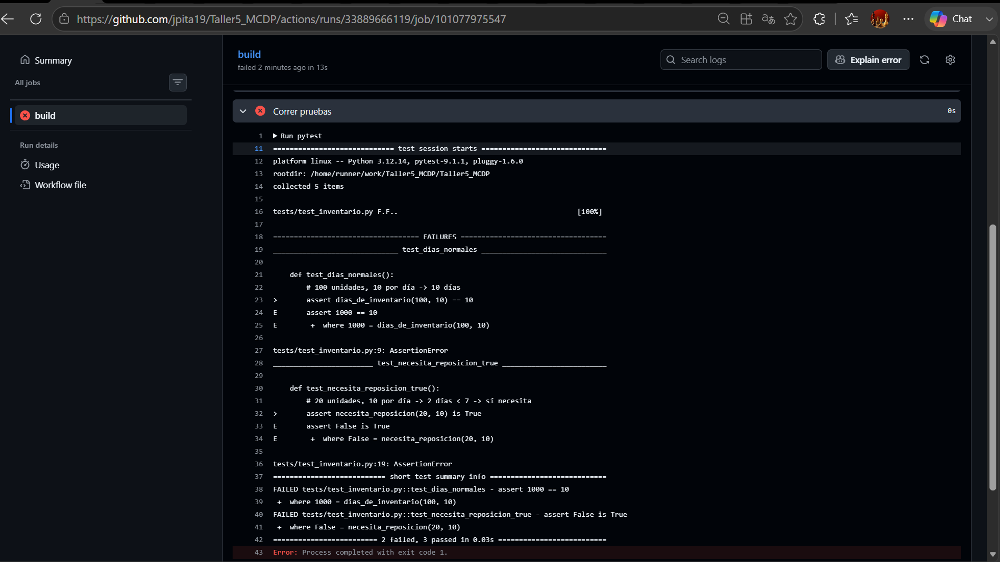
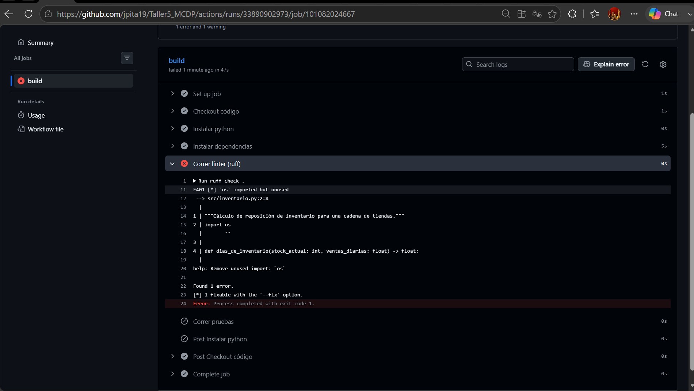

# Taller Semana 5 — El pipeline que nunca se escribió

## Pipeline de Integración Continua (CI)

**Taller realizado por:**

- Angie Valentina Coba
- Daniel Alfonso Gutiérrez Novoa
- Jorge Luis Pitalúa

---

## 1. Descripción del proyecto

Este repositorio corresponde al **Taller Semana 5 — "El pipeline que nunca se escribió"**.

El proyecto parte de un módulo sencillo para calcular la reposición de inventario de una cadena de tiendas. El código cuenta con pruebas automatizadas que permiten verificar que la lógica de negocio siga funcionando correctamente después de realizar cambios.

El objetivo principal del taller es implementar un proceso de **Integración Continua (Continuous Integration — CI)** utilizando **GitHub Actions**.

Con este proceso, cada vez que se realiza un `push` o se trabaja mediante un `pull request`, GitHub ejecuta automáticamente una serie de verificaciones sobre el proyecto.

El flujo implementado puede resumirse así:

```text
Cambio en el código
        ↓
Push / Pull Request
        ↓
GitHub Actions
        ↓
Checkout del repositorio
        ↓
Instalación de Python
        ↓
Instalación de dependencias
        ↓
Ruff
        ↓
Pytest
        ↓
¿Todo pasa?
   ↙           ↘
 SÍ             NO
Verde           Rojo
```

De esta manera, la revisión del proyecto deja de depender exclusivamente de que una persona recuerde ejecutar manualmente las pruebas antes de subir sus cambios.

---

## 2. Estructura del repositorio

La estructura principal del proyecto es:

```text
Taller5_MCDP/
│
├── .github/
│   └── workflows/
│       └── ci.yml
│
├── screenshots/
│   ├── verde-historial.png
│   ├── rojo-test.png
│   └── rojo-lint.png
│
├── src/
│   ├── __init__.py
│   └── inventario.py
│
├── tests/
│   ├── __init__.py
│   └── test_inventario.py
│
├── .gitattributes
├── .gitignore
├── ENUNCIADO_TALLER.md
├── README.md
└── requirements.txt
```

### Responsabilidad de cada componente

**`.github/workflows/ci.yml`**

Define el workflow de GitHub Actions. Allí se especifica cuándo debe ejecutarse el pipeline y cuáles son las verificaciones que debe realizar.

**`src/inventario.py`**

Contiene la lógica del negocio relacionada con el cálculo de los días disponibles de inventario y la decisión de si una tienda necesita reposición.

**`tests/test_inventario.py`**

Contiene las pruebas automatizadas que verifican diferentes comportamientos esperados de las funciones del módulo de inventario.

**`requirements.txt`**

Define las dependencias necesarias para ejecutar las verificaciones del proyecto.

**`screenshots/`**

Contiene las evidencias de las diferentes ejecuciones del pipeline en GitHub Actions.

**`ENUNCIADO_TALLER.md`**

Contiene las instrucciones originales del Taller Semana 5.

---

## 3. Entorno utilizado

El proyecto fue verificado utilizando:

```text
Python 3.12
pytest 9.1.1
ruff 0.14.0
```

Las dependencias directas del proyecto se encuentran definidas en `requirements.txt`:

```text
pytest==9.1.1
ruff==0.14.0
```

---

## 4. Ejecución local

Antes de implementar el proceso de Integración Continua, se verificó que el proyecto pudiera ejecutarse correctamente de manera local.

### Crear un entorno virtual

En Windows:

```powershell
python -m venv .venv
.venv\Scripts\Activate.ps1
```

En Linux o macOS:

```bash
python -m venv .venv
source .venv/bin/activate
```

### Instalar las dependencias

```bash
python -m pip install -r requirements.txt
```

### Ejecutar Ruff

```bash
python -m ruff check .
```

Cuando el código cumple las verificaciones del linter, el resultado esperado es:

```text
All checks passed!
```

### Ejecutar las pruebas

```bash
python -m pytest
```

El proyecto contiene **5 pruebas automatizadas**.

Cuando todas pasan correctamente, el resultado esperado es equivalente a:

```text
5 passed
```

El uso de `python -m` permite ejecutar Ruff y pytest mediante el mismo intérprete de Python donde fueron instaladas las dependencias, evitando problemas relacionados con la configuración del `PATH` del sistema.

---

# 5. El workflow de Integración Continua

El archivo responsable del pipeline se encuentra en:

```text
.github/workflows/ci.yml
```

El workflow fue configurado para ejecutarse automáticamente ante dos eventos:

```yaml
on:
  push:
  pull_request:
```

Esto significa que el proceso de validación se ejecuta:

- cada vez que se hace un `push` al repositorio;
- cada vez que se abre o actualiza un `pull request`.

El job utiliza:

```yaml
runs-on: ubuntu-latest
```

Por lo tanto, las verificaciones se ejecutan en una máquina limpia proporcionada por GitHub Actions con Ubuntu.

---

# 6. ¿Qué hace el workflow?

El pipeline ejecuta cinco pasos principales.

## Paso 1 — Checkout del código

```yaml
- name: Checkout código
  uses: actions/checkout@v4
```

Este paso descarga el contenido del repositorio dentro del runner de GitHub Actions.

Es indispensable porque el runner comienza como una máquina limpia. Sin `checkout`, la máquina no tendría disponible nuestro código, los tests ni el archivo `requirements.txt`.

---

## Paso 2 — Instalar Python

```yaml
- name: Instalar python
  uses: actions/setup-python@v5
  with:
    python-version: "3.12"
```

Este paso configura **Python 3.12**, que es la versión definida para ejecutar el proyecto dentro del pipeline.

Esto permite que la ejecución sea consistente y no dependa de la versión de Python instalada en el computador de cada integrante del equipo.

---

## Paso 3 — Instalar dependencias

```yaml
- name: Instalar dependencias
  run: pip install -r requirements.txt
```

El runner instala las dependencias declaradas en `requirements.txt`.

En este proyecto se utilizan:

- `pytest`, para ejecutar las pruebas automatizadas;
- `ruff`, para verificar la calidad y consistencia del código.

---

## Paso 4 — Ejecutar el linter

```yaml
- name: Correr linter (ruff)
  run: ruff check .
```

Ruff analiza el código para identificar problemas como:

- imports que no se utilizan;
- errores de estilo;
- determinadas inconsistencias del código;
- incumplimientos de las reglas verificadas por el linter.

Si Ruff encuentra un error, devuelve un código de salida diferente de cero.

GitHub Actions interpreta ese resultado como un fallo y el pipeline queda marcado en **rojo**.

---

## Paso 5 — Ejecutar las pruebas

```yaml
- name: Correr pruebas
  run: pytest
```

Pytest busca y ejecuta automáticamente las pruebas del proyecto.

Actualmente se ejecutan **5 pruebas** que verifican el comportamiento de las funciones relacionadas con el inventario.

Si todas las pruebas pasan, este paso termina correctamente.

Si al menos una prueba falla, pytest devuelve un código de salida diferente de cero y GitHub Actions marca la ejecución como fallida.

---

# 7. Pruebas automatizadas

El archivo:

```text
tests/test_inventario.py
```

contiene cinco pruebas.

Estas permiten verificar, entre otros casos:

- el cálculo normal de días disponibles de inventario;
- el comportamiento cuando no existen ventas;
- la identificación de una situación que requiere reposición;
- la identificación de una situación que no requiere reposición;
- el rechazo de valores negativos de inventario.

Por ejemplo:

```python
def test_dias_normales():
    assert dias_de_inventario(100, 10) == 10
```

Este test expresa una condición esperada del sistema:

> Si existen 100 unidades disponibles y se venden 10 unidades por día, el inventario debe durar 10 días.

El `assert` convierte esta expectativa en una verificación automática.

Si una modificación futura hace que la función entregue un resultado diferente, pytest detectará inmediatamente la inconsistencia.

---

# 8. Evidencias del pipeline

Para comprobar que el proceso de CI realmente detecta diferentes tipos de problemas, se realizaron ejecuciones controladas en las que se introdujeron errores intencionales y posteriormente se corrigieron.

El historial completo de ejecuciones puede consultarse en la pestaña **Actions** del repositorio:

[Ver historial de GitHub Actions](https://github.com/jpita19/Taller5_MCDP/actions)

---

## 8.1. Historial de corridas: verde → rojo → verde



La evidencia muestra diferentes ejecuciones del workflow.

Se observa el comportamiento esperado de Integración Continua:

```text
Código correcto
      ↓
Pipeline verde
      ↓
Se introduce un error
      ↓
Pipeline rojo
      ↓
Se corrige el error
      ↓
Pipeline vuelve a verde
```

Esto demuestra que GitHub Actions no solamente ejecuta el workflow, sino que puede detectar automáticamente cambios que afectan la calidad o el funcionamiento del proyecto.

---

## 8.2. Evidencia de fallo detectado por pytest



Para probar el comportamiento del pipeline se introdujo deliberadamente un error en la lógica del cálculo de inventario.

La modificación provocó que pruebas que anteriormente pasaban comenzaran a fallar.

Pytest reportó:

```text
2 failed, 3 passed
```

Entre los errores detectados se encontraba un resultado equivalente a:

```text
assert 1000 == 10
```

La prueba esperaba que:

```python
dias_de_inventario(100, 10)
```

produjera:

```text
10
```

pero el código modificado devolvió:

```text
1000
```

También falló la prueba que verificaba la necesidad de reposición.

El pipeline terminó con:

```text
Process completed with exit code 1
```

Por esta razón GitHub Actions marcó la ejecución en **rojo**.

### ¿Qué demuestra esta prueba?

Demuestra que CI puede detectar automáticamente un cambio que rompe la **lógica de negocio**, incluso cuando el código puede ejecutarse sintácticamente.

Posteriormente se corrigió el error y las pruebas volvieron a pasar, llevando nuevamente el pipeline a verde.

---

## 8.3. Evidencia de fallo detectado por Ruff



También se realizó una segunda prueba controlada agregando deliberadamente:

```python
import os
```

sin utilizarlo posteriormente en el código.

Ruff detectó:

```text
F401 `os` imported but unused
```

y mostró:

```text
Found 1 error.
```

Finalmente, el proceso terminó con:

```text
Process completed with exit code 1
```

Como el paso de Ruff falló, GitHub Actions marcó el pipeline en **rojo**.

Además, el paso posterior de pytest no necesitó ejecutarse porque el pipeline ya había encontrado un incumplimiento en una etapa anterior.

### ¿Qué demuestra esta prueba?

Demuestra que CI no solamente verifica que las funciones produzcan los resultados esperados.

También controla automáticamente aspectos relacionados con la **calidad del código** antes de continuar con las siguientes verificaciones.

Después de eliminar el import innecesario, Ruff volvió a pasar y el pipeline regresó a verde.

---

# 9. Trazabilidad mediante Git

El desarrollo del taller se realizó mediante commits que permiten observar la evolución del pipeline.

Entre los cambios realizados se encuentran:

```text
Agrega workflow de CI: checkout, setup-python, install, ruff, pytest

Introduce un bug intencional en el cálculo de la reposición

Corrige bug de reposición introducido en el commit anterior

Introduce import sin usar (para probar CI)

Elimina import sin usar, pipeline vuelve a verde

Agrega capturas de evidencia del pipeline

Completa README con documentación del pipeline, evidencias y defensa
```

Esta secuencia permite reconstruir el proceso seguido durante el taller:

```text
Implementación
      ↓
Verificación
      ↓
Error intencional
      ↓
Detección automática
      ↓
Corrección
      ↓
Nueva verificación
```

La trazabilidad de Git es especialmente importante porque permite identificar **qué cambio introdujo un problema y qué modificación lo corrigió**.

---

# 10. ¿Qué significa que el pipeline esté verde o rojo?

## Pipeline verde

Una ejecución verde significa que todos los controles configurados terminaron correctamente.

En este proyecto implica que:

```text
✓ El repositorio pudo descargarse
✓ Python pudo configurarse
✓ Las dependencias pudieron instalarse
✓ Ruff no encontró incumplimientos
✓ Las 5 pruebas de pytest pasaron
```

El código superó los controles automáticos definidos por el proyecto.

---

## Pipeline rojo

Una ejecución roja significa que al menos uno de los controles falló.

Por ejemplo:

```text
Ruff encuentra un import sin utilizar
                ↓
           Pipeline rojo
```

o:

```text
Una prueba encuentra un resultado incorrecto
                ↓
           Pipeline rojo
```

El color rojo no representa un problema del sistema de CI.

Por el contrario, significa que **el pipeline está cumpliendo su función al detectar un problema antes de que el cambio continúe avanzando sin revisión**.

---

# 11. La defensa: Pull Request con un test que falla

Si un compañero abre o actualiza un **Pull Request** con un cambio que hace fallar una prueba, el evento:

```yaml
pull_request:
```

dispara automáticamente el workflow.

GitHub Actions comienza entonces una ejecución independiente en la que:

1. descarga el código del repositorio;
2. configura Python 3.12;
3. instala las dependencias;
4. ejecuta Ruff;
5. ejecuta pytest.

Si pytest encuentra una prueba fallida, devuelve un código de salida diferente de cero.

GitHub Actions interpreta ese resultado como un fallo y muestra el check correspondiente en **rojo** dentro del Pull Request.

De esta manera, el equipo puede identificar el problema **antes de integrar el cambio a la rama principal**.

Si además el repositorio tiene configurada una regla de protección de rama o un `ruleset` que establezca el CI como un control obligatorio, GitHub puede impedir el merge mientras el check permanezca en rojo.

Por tanto, existen dos componentes complementarios:

```text
GitHub Actions
      ↓
DETECTA y reporta el problema

Regla de protección de rama
      ↓
puede BLOQUEAR el merge hasta corregirlo
```

Esto protege el proyecto porque convierte los controles de calidad en un proceso automático y visible para todo el equipo.

La revisión deja de depender únicamente de que una persona recuerde ejecutar manualmente las pruebas.

---

# 12. ¿Por qué CI protege este proyecto?

Antes de implementar CI, una modificación incorrecta podía seguir este camino:

```text
Persona modifica el código
        ↓
No ejecuta las pruebas
        ↓
Sube el cambio
        ↓
El error permanece oculto
        ↓
El problema aparece posteriormente
```

Con Integración Continua el proceso cambia:

```text
Persona modifica el código
        ↓
Push / Pull Request
        ↓
GitHub Actions se activa automáticamente
        ↓
Ruff + pytest
        ↓
¿Todo funciona?
   ↙           ↘
 SÍ             NO
Verde        Rojo
             ↓
          Corregir
```

La principal ventaja es que la verificación se realiza de manera **automática, repetible y consistente**.

La misma secuencia de controles se ejecuta independientemente de quién realice el cambio.

---

# 13. Aprendizajes del taller

Este taller permitió integrar varios conceptos fundamentales del desarrollo de software:

### Tests automatizados

Los tests convierten comportamientos esperados del sistema en verificaciones ejecutables.

### `assert`

Permite expresar una condición que debe ser verdadera para considerar correcta una prueba.

### Pytest

Descubre y ejecuta automáticamente las pruebas del proyecto.

### Ruff

Permite identificar problemas de calidad y consistencia del código.

### GitHub Actions

Ejecuta automáticamente los controles definidos en el workflow.

### Integración Continua

Permite revisar cada cambio de forma automática antes de que continúe avanzando en el proceso de desarrollo.

### Git

Mantiene la trazabilidad de los cambios y permite identificar cuándo se introdujo y cuándo se corrigió un problema.

---

# 14. Resultado final

El proyecto cuenta actualmente con un pipeline de Integración Continua que ejecuta automáticamente:

```text
Push / Pull Request
        ↓
Checkout
        ↓
Python 3.12
        ↓
Instalación de dependencias
        ↓
Ruff
        ↓
Pytest
        ↓
Resultado del pipeline
```

Las pruebas realizadas demostraron tres comportamientos fundamentales:

| Escenario | Resultado |
|---|---|
| Código correcto + tests correctos | Pipeline verde |
| Error en la lógica detectado por pytest | Pipeline rojo |
| Error de calidad detectado por Ruff | Pipeline rojo |
| Corrección de los errores | Pipeline vuelve a verde |

Las evidencias almacenadas en el repositorio permiten comprobar cada uno de estos escenarios.

---

# 15. Conclusión

La implementación del pipeline permite que el proyecto se revise automáticamente cada vez que se realiza un `push` o se trabaja mediante un `pull request`.

El valor de CI no consiste solamente en ejecutar comandos automáticamente, sino en establecer una **barrera de calidad reproducible**.

En este taller se comprobó que el pipeline puede detectar tanto errores en la lógica del negocio mediante **pytest** como problemas de calidad del código mediante **Ruff**.

El flujo final puede resumirse así:

```text
ANTES

Modificar código
      ↓
Confiar en que alguien recuerde probarlo


AHORA

Modificar código
      ↓
Push / Pull Request
      ↓
GitHub Actions
      ↓
Ruff + pytest
      ↓
Evidencia automática
      ↓
Verde: controles superados
Rojo: revisar y corregir
```

De esta manera, los errores pueden identificarse más cerca del momento en que se introducen, se mantiene la trazabilidad mediante Git y se reduce el riesgo de integrar cambios que afecten el funcionamiento del proyecto.
